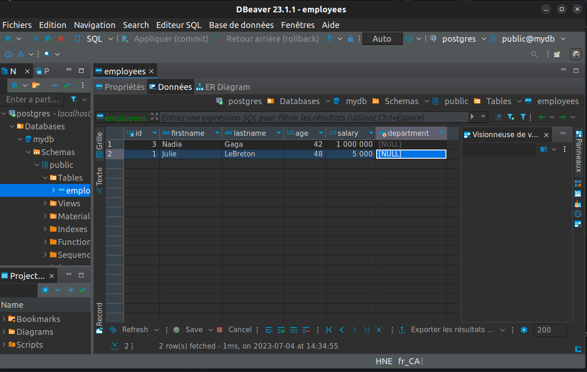

# Exercise 7

Add a new column named "department" of type text to the "employees" table.

## Solution

```shell
ALTER TABLE employees ADD department VARCHAR(255);
```

or

```shell
ALTER TABLE employees ADD COLUMN department VARCHAR(255);
```

Note that null values will not be displayed:

```shell
mydb=# select * from employees;
  3 | Nadia     | Gaga     |  42 | 1000000 |
  1 | Julie     | LeBreton |  48 |    5000 |
```

But the new column is there if we look at the table with ui client


